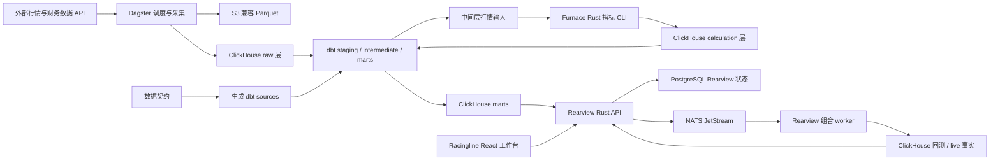

# mono-fleur


mono-fleur 是一个基于 harness-engineering 实践的面向 A 股市场研究的多工程量化平台，覆盖行情与财务数据采集、技术指标计算、规则选股、策略回测、T+1 策略组合发布以及组合运行监控。

仓库将 Python 数据平台、Rust 计算与服务引擎、React 前端工作台统一收纳在同一个 monorepo 中：

- **Pipeline**：基于 Dagster 编排外部数据采集，落盘至 S3 兼容的 Parquet，并同步到 ClickHouse raw 层。
- **ELT**：基于 dbt 在 ClickHouse 之上分层维护 staging、intermediate、calculation wrapper 与 marts 模型。
- **Contracts**：以数据契约治理 source payload、Parquet schema、raw 表、自动生成的 dbt sources 及数据字典。
- **Furnace**：Rust CLI，负责计算 KDJ、MA、RSI、BOLL、MACD 等技术指标及价格行为结构指标。
- **Rearview**：Rust HTTP 服务与异步 worker，提供规则选股、策略回测、组合发布与订阅策略跟踪法能力。
- **Racingline**：React 前端工作台，支持策略创建、股池预览、回测结果查看、T+1 模拟建仓与订阅组合监控。


## 风险提示与免责声明

为使用户更好地了解开发者 WackyGem（以下简称"本人"）开发的 mono-fleur 沪深 A 股投研模拟项目（以下简称"本项目"），请务必详细阅读并充分理解以下风险：

1. 本项目使用中文互联网免费公开数据源作为基础数据进行数据加工、计算和分析，但不保证数据的及时性、准确性、真实性与完整性。
2. 在遵守国家相关法律、法规、规章及自律组织规则、监管政策的前提下，本项目尽力为用户提供高速、完整、准确的金融数据服务；但因受数据来源、技术能力等多种因素影响，本人不保证数据源的及时性、准确性或完整性。因数据源遗漏、错误、丢失、延迟、中断可能造成的损失将由您自行承担，本人不承担任何责任。
3. 本项目所提供的信息、数据等全部内容仅供参考。使用者须自行确认具备理解相关内容的专业能力并保持独立判断。任何情况下，本项目提供的内容均不构成对投资者的投资建议；据此操作的一切风险与损失由投资者自行承担，本人不对任何人因参考上述内容造成的直接或间接损失或与此相关的其他损失承担任何责任。
4. 本项目提供的 Skill 示例、MCP 示例、Python 库、提示词等均为学习与参考用途，不构成业务承诺、技术保证或服务合约，不构成任何投资建议、投资分析或投资咨询意见，不承诺收益、不保证盈利。
5. 本项目可能不时更新或升级。因您未及时变更或升级而发生的任何损失，由您自行承担。
6. 本项目不提供 AI 模型。因 AI 模型存在算法局限性、推理误差、上下文理解偏差，可能出现数据错误、逻辑疏漏、结果不准确等问题。本人不对 AI 调用结果、数据准确性、使用效果、投资收益作任何明示或暗示的担保，不对您因使用相关内容产生的任何直接或间接损失承担责任。
7. 本免责声明无法揭示您使用本项目及通过本项目从事投资交易的所有风险。在使用本项目之前，应全面了解相关法律法规与有关规定，对自身的经济承受能力、风险承受能力、投资目标、风险控制能力等综合考虑，作出客观判断，对投资交易作仔细研究。
8. 您需妥善保管账号、密钥与运行环境。因您自身保管不当、第三方工具、网络攻击、设备故障等导致的风险与损失，由您自行负责。

本声明适用本项目发布的所有代码、工具、接口与文档。如有更新，以本项目仓库为准恕不另行通知。


## 架构概览



## 目录结构

| 路径 | 说明 |
|---|---|
| [`pipeline/scheduler/`](pipeline/scheduler/) | Dagster 数据采集、资产编排、Parquet 写入与 ClickHouse raw 同步 |
| [`pipeline/elt/`](pipeline/elt/) | dbt 项目，维护 staging、intermediate、calculation wrapper、marts 及数据测试 |
| [`pipeline/contracts/`](pipeline/contracts/) | raw 层数据契约注册表 |
| [`pipeline/contract_tools/`](pipeline/contract_tools/) | contract 校验、生成物、schema adapter 与数据字典工具 |
| [`pipeline/migrate/`](pipeline/migrate/) | PostgreSQL `pipeline` 与 `rearview` target 的 Alembic 迁移 |
| [`engines/`](engines/) | Rust workspace，包含 Furnace、Rearview server、Rearview core 与 portfolio worker |
| [`app/racingline/`](app/racingline/) | Vite + React + TypeScript 前端工作台 |
| [`deploy/`](deploy/) | Docker Compose、本地基础设施、PostgreSQL 配置与 release manifest |
| [`docs/`](docs/) | 架构事实、ADR、RFC、运行报告、发布记录、reference 与 runbook |

## 快速开始

### 前置依赖

- Docker 与 Docker Compose
- `make`
- `uv`，用于管理 Python workspace
- Python 3.12.13，版本见 [`pipeline/.python-version`](pipeline/.python-version)
- 支持 Rust 2024 edition 的 Rust toolchain
- Node.js 与 npm；Racingline 当前声明 `npm@11.13.0`

### 准备本地配置

```bash
cp .env.example .env
```

运行服务前请先编辑 `.env`，真实凭据与本地密钥请勿提交到 Git。

### 安装依赖

```bash
cd pipeline
uv sync --all-packages --all-groups

cd ../app/racingline
npm install
```

Rust 依赖由 Cargo 在 `engines/` 下构建或运行命令时自动解析。

### 启动完整工作台

在仓库根目录执行：

```bash
make racingline-dev
```

该命令会依次启动本地 Docker 依赖、执行 PostgreSQL migration、同步 Rearview metric catalog、启动 Rearview HTTP 服务与 Rearview portfolio worker，并启动 Racingline Vite dev server。

- 前端地址：`http://127.0.0.1:5173/`
- Rearview API：`http://127.0.0.1:34057/`

停止前后端 dev server：

```bash
make racingline-dev-stop
```

停止 Docker 依赖：

```bash
make dev-down
```

## 常用命令

### 数据平台

```bash
cd pipeline
uv run dbt parse --project-dir elt --profiles-dir elt

cd scheduler
uv run dg check defs
```

### 数据契约

```bash
cd pipeline
uv run fleur-contracts validate
uv run fleur-contracts generate --check
```

### Rust engines

```bash
cd engines
cargo fmt --check
cargo clippy --workspace --all-targets --all-features -- -D warnings
cargo test --workspace
```

Furnace dry-run 示例：

```bash
cd engines
cargo run -p furnace -- kdj \
  --from 2026-05-06 \
  --to 2026-06-01 \
  --symbols 000069.SZ \
  --mode dry-run \
  --output-format json
```

### Racingline 前端

```bash
cd app/racingline
npm run lint
npm run typecheck
npm test
npm run build
```

### 文档与版本检查

```bash
make docs-check
make versions-check
git diff --check
```

生成本地文档：

```bash
make dbt-docs-serve
make rust-doc-serve
```

## 当前发布快照

当前集成发布快照记录在 [`deploy/release-manifest.yml`](deploy/release-manifest.yml)。

| 字段 | 值 |
|---|---|
| Release | `mono-fleur-2026.06.1` |
| Commit | `3c20eb538e8aabc1622bbcaada450868b1f6a61c` |
| Pipeline database head | `0008_strategy_portfolio_cp` |
| Rearview database head | `0008_strategy_portfolio_cp` |
| 验证状态 | `versions-check`、`docs-check`、Rust、Python、data platform 与 Racingline 均已通过 |

| 组件 | 版本 |
|---|---|
| `scheduler` | `0.1.0` |
| `contract-tools` | `0.1.0` |
| `elt` | `1.0.0` |
| `furnace` | `0.1.0` |
| `rearview-server` | `0.1.0` |
| `rearview-portfolio-worker` | `0.1.0` |
| `racingline` | `0.0.1` |

发布记录与 tag 前检查见 [`docs/releases/`](docs/releases/)。

## 文档入口

| 主题 | 入口 |
|---|---|
| 项目状态 | [`docs/architecture/project-status.md`](docs/architecture/project-status.md) |
| 数据平台 | [`docs/architecture/data-platform.md`](docs/architecture/data-platform.md) |
| 数据治理 | [`docs/architecture/data-governance.md`](docs/architecture/data-governance.md) |
| Furnace 计算引擎 | [`docs/architecture/furnace.md`](docs/architecture/furnace.md) |
| Rearview 后端 | [`docs/architecture/rearview.md`](docs/architecture/rearview.md) |
| Racingline 前端 | [`docs/architecture/racingline.md`](docs/architecture/racingline.md) |
| 部署与运行 | [`docs/architecture/deploy-ops.md`](docs/architecture/deploy-ops.md) |
| 运行报告 | [`docs/jobs/reports/`](docs/jobs/reports/) |
| 接口与数据参考 | [`docs/references/`](docs/references/) |

## 许可证与发布说明

本项目使用 MIT License，完整条款见 [`LICENSE`](LICENSE)。

Rust workspace 当前标记为 `license = "MIT"` 且 `publish = false`。`publish = false` 仅表示当前 crates 不会发布到公开 registry，不影响仓库源码按 MIT 协议发布。

## 数据与安全提示

- `.env` 包含凭据，请勿提交到版本控制。
- `.env.example` 中的默认值仅适合本地占位。
- 外部行情、财务与图片数据的可用性、限流及凭据均依赖上游服务。
- 回测与组合结果属于研究产物，使用前需复核数据范围、模型假设与执行约束。


