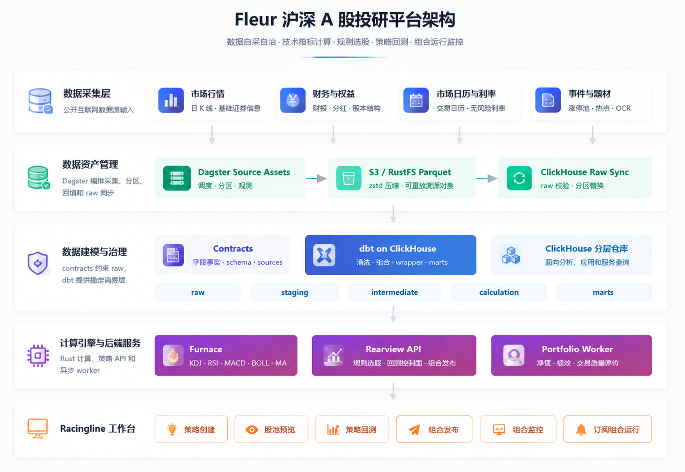

# Fleur


使用本项目前请先阅读 [`风险提示与免责声明`](SECURITY.md#风险提示与免责声明)

## 📖 项目介绍

Fleur 是一个由 harness-engineering 驱动的 100% AI Coding 的面向沪深 A 股投研平台，覆盖行情与财务数据采集、技术指标计算、规则选股、策略回测、及组合运行监控。

### 🎯 Fleur 聚焦的问题

- **数据自采自洽**：采集中文互联网公开数据，从源头治理字段事实，做到数据高质量、口径自洽、可重放、可回填。
- **指标公式可解释**: 实现指标计算引擎，技术指标指标算法可溯源。
- **可视化策略构建**：支持 `行情涨跌\趋势指标\动量指标\形态特征\量能指标` 等数上百个技术指标的可视化实时筛选，构建策略零代码。
- **快速策略回测**：实现高性能回测引擎与投资组合评价体系，快速多维度评价策略过往业绩表现。
- **成本控制**：完全免费、从数据到应用不产生任何费用。


### 🧩 领域与感知

| 领域 | 工程 | 感知 |
| :--- | :--- | :--- |
| **数据基座** | 数据管道（Pipeline） | 稳定、可追溯的数据接入，确保原始数据完整留存，支持回放与审计。 |
| | ELT 分层建模 | 清晰的数据分层，降低分析复杂度；指标口径统一，即用即查，减少重复开发。 |
| | 数据契约治理 | 数据质量有保障，字段变更可追踪；自动生成的文档让快速上手，减少沟通成本。 |
| **计算引擎与服务** | Furnace（指标计算） | 毫秒级批量计算，支持海量证券标的；指标结果可靠，可直接用于策略逻辑。 |
| | Rearview（主服务） | 实时信号推送、组合监控，辅助决策与风险控制。 |
| | Rearview-worker（回测引擎） | 快速验证投资想法，回测历史表现，获取绩效指标。 |
| **工作台** | Racingline（前端） | 一站式交互界面，无需编写代码即可构建策略、观察回测绩效、管理模拟持仓，降低使用门槛。 |

---

## 🏗️ 架构总览
<div align="center">
    
</div>

### 🧱 数据基座

本项目所使用数据均来自中文互联网可合法免费获取的公开数据源，所有数据采集、加工、建模均在本项目内编码实现，不产生、不收取任何费用。

| 顺序 | 流向 | 落点 | 责任边界 |
|---|---|---|---|
| 1 | 公开数据源 | BaoStock、EastMoney、Sina、THS、ChinaBond、JiuYan 等 | 提供行情、会计财务报表、分红派息、涨停池、题材、图片等原始输入 |
| 2 | 数据资产管理 | `pipeline/scheduler`  | 采集、分区、重试、回填和运行观测 |
| 3 | 源层数据 |  RustFS(S3) 对象存储中的 Parquet | 保存可重放的源层数据对象 |
| 4 | 数据建模与治理 | `pipeline/elt` |  数据加工、清洗、跨源组合、计算、可复用业务中间结构及业务口径输出 |
| 5 | 业绩指标计算引擎 | `engines/crates/furnace` |  计算 KDJ、MA、RSI、BOLL、MACD、price-pattern 等技术指标 |
| 7 | 分层模型 | ClickHouse | raw 原始数据层、staging 字段规范化层、intermediate 可复用业务中间结构 、 calculation 业绩指标计算 、 marts 应用数据集市 |
| 8 | 应用消费 | Rearview API、Portfolio worker、Racingline 工作台 | 规则选股、策略回测、组合运行 |

--- 

### 📡 多源沪深 A 股数据采集

通过 Dagster 编排六类外部数据源，统一落盘 Parquet 文件格式（zstd压缩编码）上传至RustFS（S3 兼容），后同步至 ClickHouse raw 层。下表汇总各数据源的数据范围、分区策略与调度（均为 `Asia/Shanghai` 时区）：

| 数据源 | 采集内容 | 数据范围 | 调度时间 | 是否需要注册 |
| :--- | :--- | :--- | :--- | :--- |
| **BaoStock** 证券宝 | 沪深 A 股基础信息快照、日 K 线（OHLC） | `1990-12-19` 至今 | 每日 `17:35` | ✅ 全免费，无需注册，IP限流 |
| **EastMoney** 东方财富 | 资产负债表、利润表（SQ/YTD）、现金流（SQ/YTD）、分红派息、股权历史、十大流通股东 | `1990` 至今 | 每日 `16:00` | ✅ 全免费，无需注册 |
| **Sina** 新浪财经 | A 股交易日历（压缩位流解码） | `1990-12-19` 至本年年末 | 年末 `12/25–12/31` 每日 `09:00` | ✅ 全免费，无需注册 |
| **THS** 同花顺 | 涨停股池（近 380 个自然日滚动） | 近 380 个自然日 | 每日 `16:45` | ✅ 全免费，无需注册 |
| **ChinaBond** 中债信息网 | 国债收益率曲线（3月期–30年期，共 11 个期限） | `2006` 至今 | 每日 `16:00` | ✅ 全免费，无需注册 |
| **JiuYan** 韭研公社（非必须） | 个股异动、题材热点（题材库需 OCR 识图 + LLM 抽取） | `2021-01-01` 至今 | 异动 `16:45`；题材 `17:30`；OCR `17:35` | ⚠️ 需注册，全免费，账号限流 |

</br>

> **📋 回填优先级与数据源注意事项** </br>
>
> 以下为各数据源的回填策略与技术约束，按优先级与依赖关系排列。
>
> ---
>
> **1. 公共数据依赖（优先回填）**
>
> - **Baostock 证券基础信息快照** & **Sina 交易日历**：作为全局公共依赖，需优先完成回填。
>
> ---
>
> **2. [BaoStock] 行情数据**
>
> - **数据范围**：日 K 线覆盖 `1990-12-19` 至今，但建议回填起点不早于 **`1995-01-02`**（此前短暂出现过 T+0 且存在大额拆股，数据质量偏低）。
> - **限流规则**：每 IP 每日 `50,000` 次调用，`login` 并行数 ≤ `5`（规则时效：`2026-06-22`）。
> - **性能指标**：本项目重写了官方 SDK，支持 `asyncio` 协程采集与连接池复用。网络正常时：
>   - 逐年回填（2020–2026）≤ **10 分钟/年**
>   - 单日全市场同步 ≤ **4 分钟**
>   - 只用应用层的话回填个3年够用
>
> ---
>
> **3. [EastMoney] 财务与股东数据**
>
> - **覆盖内容**：五大财务报表 + 分红派息 + 股权历史 + 十大流通股东。
> - **回填策略**：建议回填至 `1990` 年至今，协程并行全量回填 ≤ **30 分钟**。
>
> ---
>
> **4. [ChinaBond] 国债利率**
>
> - **数据范围**：`2006` 年至今完整数据。
> - **计算口径**：采用 **一年期国债收益率** 作为无风险收益基准。
>
> ---
>
> **5. [JiuYan] 韭研公社（非必需，按需启用）**
>
> - **数据定位**：短线情绪题材库，非 APP 层核心依赖，不回填不影响应用功能。
> - **限流约束**：每账号每日 `80` 次调用（异动行情接口）。
> - **技术方案**：
>   - 数据源为**题材库图片**，需经 OCR 识别后，调用多模态 LLM 进行信息抽取 （推荐 vllm 本地部署 `Qwen3.5-4B-Instruct`，本项目已针对该场景做 prompt 优化及参数调优）。
>   - 已实现完整 ETL 流程：`图片下载(S3) → LLM 抽取 → Parquet 写入 → ClickHouse 同步`。
>   - 控制平面基于 **Postgres 状态机**，支持失败自动重跑。

---

### ⚙️ 技术指标与组合评价体系

Furnace 负责技术指标计算；Rearview portfolio worker 负责组合绩效与交易质量评价。

| 体系 | 分类 | 已支持 |
|---|---|---|
| 技术指标 | 动量指标 | KDJ、RSI、MACD |
| 技术指标 | 趋势均线 | MA、EMA、BOLL |
| 技术指标 | 量能指标 | 成交量均线 |
| 技术指标 | 价格结构 | 连阳连阴、前低 / 次低结构 |
| 组合评价 | 收益表现 | 持有期收益、年化收益 |
| 组合评价 | 风险回撤 | 年化波动率、最大回撤、下行波动 |
| 组合评价 | 风险调整收益 | Sharpe、Sortino、Calmar |
| 组合评价 | 相对市场 | Alpha、Beta、Information Ratio、Treynor |
| 组合评价 | 交易质量 | 闭合交易数、胜率、盈亏比、平均持仓天数、最大盈利 / 亏损 |

### 🖥️ 工作台

| 能力域 | 已实现功能 |
|---|---|
| 策略创建 | 指标选股、权重配置、股池预览、模拟建仓、异步回测五步流程 |
| 规则选股 | 条件组合、评分排序、股池预览、分页候选股和个股分析 |
| 策略回测 | 回测任务创建、状态跟踪、净值曲线、调仓记录、持仓交易和绩效结果 |
| 组合发布 | 从回测结果建立 T+1 策略组合，发布前完成信号日和运行日预检 |
| 组合监控 | Dashboard 组合概览、组合详情、待调入信号、净值、绩效和调仓记录 |
| 后台执行 | Rearview HTTP API、portfolio worker、异步任务分发和组合每日运行 |
| 自动化运行 | 交易日调度、数据采集、dbt + Furnace 构建和定向回填 |

---

## 🛠️ 开发与协同

### 🔁 Developer + Codex CLI 协作流程

Fleur 的需求交付采用“先规划、再执行、后反馈”的闭环。复杂需求不直接进入实现，先把讨论、决策、计划和验收证据沉淀到仓库文档，确保后续 agent 可以复用同一套事实链。

<div align="center">
    <a href="assets/Developer-Agent%20Collaboration.png">
        
    </a>
</div>

| 阶段 | 角色 | 步骤 | 目标 | 交付物 |
|---|---|---|---|---|
| 阶段一：需求规划 | 开发者 + Codex CLI | 1. 需求草案 RFC | 提出需求，讨论设计方向，盘点现有代码资产、架构边界与落地缺口 | [`docs/RFC/`](docs/RFC/) 需求 RFC；必要时补充 [`docs/ADR/`](docs/ADR/) 长期决议 |
|  |  | 2. 执行计划 Plan | 拆解任务、明确本轮目标、识别风险和注意点，给出改动清单、验收标准与证据链要求 | [`docs/plans/`](docs/plans/) 执行计划，包含实施步骤、改动范围 checklist、验收方案和证据链标准 |
| 阶段二：执行与修改 | Codex CLI | 3. 加载工程上下文 | 阅读 [`AGENTS.md`](AGENTS.md)、[`docs/README.md`](docs/README.md)、相关架构事实文档和 [`docs/skills/`](docs/skills/) runbook，按 skill 路由加载专业能力 | 已确认的上下文入口、适用 skill、质量门禁和实现边界 |
|  |  | 4. 实施开发 | 按 Plan 分阶段改代码；每完成一个阶段回查 checklist，确认实现没有偏离 RFC、ADR 和现有架构边界 | 代码、配置、迁移、模型或前端变更 |
|  |  | 5. 自动化测试与验收 | 按 Plan 执行最小可证明的自动化检查；数据层记录验收报告，后端接口和前端联调用 Playwright 做 E2E 截图验收 | [`docs/jobs/reports/`](docs/jobs/reports/) 验收报告；必要的日志、SQL、命令输出和截图证据 |
| 阶段三：反馈 | 开发者 | 6. 人工复验与下一轮 | 人工复验结果，对偏差进行纠偏和微调；新问题回到步骤 1，进入下一轮 RFC / Plan / 实施闭环 | 反馈结论、后续 RFC / Plan 或补充验收记录 |

执行时遵守三条约束：

- **事实先行**：实现前先从代码、测试、架构事实文档和 runbook 确认真实路径，不把不确定性写进代码。
- **证据闭环**：Plan 必须提前定义验收命令、截图或数据核验标准；Report 必须记录实际执行结果和无法验证的原因。
- **文档归位**：短期讨论写 RFC，长期约束写 ADR，分阶段实施写 Plan，实际运行和验收写 Report；完成或废弃后按 [`docs/README.md`](docs/README.md) 的状态约定归档。

### 🗂️ 工程目录

| 路径 | 说明 |
|---|---|
| [`pipeline/scheduler/`](pipeline/scheduler/) | Dagster 数据采集、资产编排、Parquet 写入与 ClickHouse raw 同步 |
| [`pipeline/elt/`](pipeline/elt/) | dbt 项目，维护 staging、intermediate、calculation wrapper、marts 及数据测试 |
| [`pipeline/contracts/`](pipeline/contracts/) | raw 层数据契约注册表 |
| [`pipeline/contract_tools/`](pipeline/contract_tools/) | contract 校验、生成物、schema adapter 与数据字典工具 |
| [`pipeline/migrate/`](pipeline/migrate/) | PostgreSQL `pipeline` 与 `rearview` target 的 Alembic 迁移 |
| [`engines/`](engines/) | Rust workspace，包含 Furnace、Rearview server、Rearview core 与 portfolio worker |
| [`app/racingline/`](app/racingline/) | Vite + React + TypeScript 前端工作台 |
| [`deploy/`](deploy/) | Docker Compose、本地基础设施、PostgreSQL 配置与 release manifest |
| [`docs/`](docs/) | 架构事实、ADR、RFC、运行报告、发布记录、reference 与 runbook |

## 🚀 快速开始

### ✅ 前置依赖

- Docker 与 Docker Compose
- `make`
- `uv`，用于管理 Python workspace
- Python 3.12.13，版本见 [`pipeline/.python-version`](pipeline/.python-version)
- 支持 Rust 2024 edition 的 Rust toolchain
- Node.js 与 npm；Racingline 当前声明 `npm@11.13.0`

### 🔐 准备本地配置

```bash
cp .env.example .env
```

运行服务前请先编辑 `.env`，真实凭据与本地密钥请勿提交到 Git。

### 📦 安装依赖

```bash
cd pipeline
uv sync --all-packages --all-groups

cd ../app/racingline
npm install
```

Rust 依赖由 Cargo 在 `engines/` 下构建或运行命令时自动解析。

### ▶️ 启动完整工作台

在仓库根目录执行：

```bash
make racingline-dev
```

该命令会依次启动本地 Docker 依赖、执行 PostgreSQL migration、同步 Rearview metric catalog、启动 Rearview HTTP 服务与 Rearview portfolio worker，并启动 Racingline Vite dev server。

- 前端地址：`http://127.0.0.1:5173/`
- Rearview API：`http://127.0.0.1:34057/`

停止前后端 dev server：

```bash
make racingline-dev-stop
```

停止 Docker 依赖：

```bash
make dev-down
```

发布记录与 tag 前检查见 [`docs/releases/`](docs/releases/)。

## 🧭 文档入口

| 主题 | 入口 |
|---|---|
| 项目状态 | [`docs/architecture/project-status.md`](docs/architecture/project-status.md) |
| 数据平台 | [`docs/architecture/data-platform.md`](docs/architecture/data-platform.md) |
| 数据治理 | [`docs/architecture/data-governance.md`](docs/architecture/data-governance.md) |
| Furnace 计算引擎 | [`docs/architecture/furnace.md`](docs/architecture/furnace.md) |
| Rearview 后端 | [`docs/architecture/rearview.md`](docs/architecture/rearview.md) |
| Racingline 前端 | [`docs/architecture/racingline.md`](docs/architecture/racingline.md) |
| 部署与运行 | [`docs/architecture/deploy-ops.md`](docs/architecture/deploy-ops.md) |
| 运行报告 | [`docs/jobs/reports/`](docs/jobs/reports/) |
| 接口与数据参考 | [`docs/references/`](docs/references/) |

## 🤝 致谢 | Acknowledgments

| 类别 | 项目 / 社区 |
|---|---|
| 资产管理 | [Dagster](https://dagster.io/) |
| 数据建模 | [dbt](https://www.getdbt.com/) |
| UI 组件 | [shadcn/ui](https://ui.shadcn.com/) |
| 数据来源 | [BaoStock 证券宝](http://baostock.com/) |
| 社区推广 | [Linux.do](https://linux.do/) |

## 📄 许可证与发布说明

本项目使用 MIT License，完整条款见 [`LICENSE`](LICENSE)。
