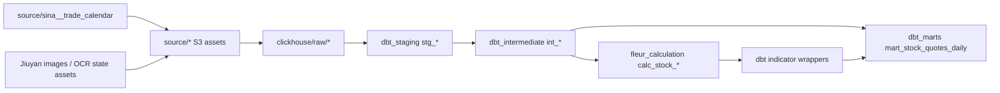

# Dagster Definitions and Lineage Snapshot

记录日期：2026-06-10

本文记录当前 `pipeline/scheduler` 已注册的 Dagster assets、jobs、schedules、sensors、resources 和血缘依赖。它是当前实现快照，不替代 `docs/architecture/scheduler-architecture.md` 和 `docs/architecture/scheduler-module-boundaries.md` 的长期架构约束。

## Evidence

本次梳理使用以下命令和源码作为事实来源：

```bash
set -a; . ./.env; set +a
cd pipeline
uv run dg list defs --target-path scheduler --json
```

关键源码入口：

- `pipeline/scheduler/src/scheduler/defs/definitions.py`
- `pipeline/scheduler/src/scheduler/defs/source_bundle.py`
- `pipeline/scheduler/src/scheduler/defs/automation/schedules.py`
- `pipeline/scheduler/src/scheduler/defs/market/schedules.py`
- `pipeline/scheduler/src/scheduler/defs/clickhouse/definitions.py`
- `pipeline/scheduler/src/scheduler/defs/dbt_jobs.py`
- `pipeline/scheduler/src/scheduler/defs/furnace/definitions.py`
- `pipeline/scheduler/src/scheduler/components/fleur_dbt.py`

## Definition Assembly

`scheduler.defs.definitions.defs()` 先装配 base definitions，再 merge dbt component 和 furnace component：

- Source bundles：`sina`、`jiuyan`、`ths`、`baostock`、`eastmoney`
- Base assets：source bundle assets + `CLICKHOUSE_RAW_ASSETS`
- Base jobs：source bundle jobs + `CLICKHOUSE_RAW_JOBS` + `DBT_JOBS`
- Base schedules：source bundle schedules + `DBT_SCHEDULES`
- Component definitions：`dbt` component + `furnace` component

当前注册计数：

| Type | Count | Notes |
|---|---:|---|
| Assets | 89 | 71 executable, 18 non-executable dbt relation handles |
| Jobs | 34 | Source, ClickHouse raw sync, dbt, Furnace |
| Schedules | 13 | Source daily/yearly schedules, dbt daily build, Furnace daily jobs |
| Sensors | 2 | Automation condition sensor + Slack asset failure sensor |
| Resources | 10 | S3, HTTP, BaoStock, ClickHouse, OCR, Slack, Furnace CLI |

## Asset Groups

| Group | Count | Executable | Role |
|---|---:|---:|---|
| `s3_sources` | 20 | 20 | 原始远端数据抓取、S3 Parquet、OCR/Postgres 状态资产 |
| `clickhouse_raw` | 16 | 16 | 从 S3 Parquet 同步到 `fleur_raw` ClickHouse raw 表 |
| `dbt_staging` | 16 | 16 | dbt staging 清洗层 |
| `dbt_intermediate` | 13 | 13 | dbt intermediate 和 Furnace 输出 wrapper |
| `calculation` | 5 | 5 | Rust Furnace 写入 `fleur_calculation` 的指标表 |
| `dbt_marts` | 1 | 1 | dbt mart 输出 |
| `default` | 18 | 0 | dagster-dbt 暴露的非执行 relation handle，当前无直接 job target |

## High-Level Lineage



要点：

- `source/sina__trade_calendar` 是交易日事实来源，驱动 Jiuyan/THS 日分区、BaoStock 年分区刷新窗口，以及对应 trade-date schedule 的 skip 判断。
- `source/baostock__query_stock_basic` 是证券 universe 事实来源，驱动 BaoStock 日 K 和全部 EastMoney F10 年分区资产。
- Jiuyan OCR 链路是 `industry_list -> industry_images -> industry_ocr -> industry_ocr_snapshot`。只有 `industry_list` 和 `industry_ocr_snapshot` 进入 ClickHouse raw sync。
- 市场事件日分区资产先落 S3，再压缩成年分区：`jiuyan__action_field -> jiuyan__action_field_compacted`、`ths__limit_up_pool -> ths__limit_up_pool_compacted`。只有 compacted 资产进入 ClickHouse raw sync。
- ClickHouse raw sync 的 enabled specs 当前共 16 个，来自 `pipeline/contracts` 生成的 scheduler specs。
- dbt staging 从 `clickhouse/raw/*` 读取；dbt intermediate/marts 由 dbt manifest 暴露。
- Furnace 资产从 `int_stock_quotes_daily_adj` 和部分 `int_stock_quotes_daily_unadj` 读取，写 `fleur_calculation.calc_stock_*`；对应 dbt wrapper 再把计算结果接回 `dbt_intermediate`。

## Source Bundle Lineage

| Source | Assets | Root dependencies | Downstream |
|---|---|---|---|
| `sina` | `source/sina__trade_calendar` | none | trade-date schedules, BaoStock daily K, Jiuyan/THS daily assets, ClickHouse raw, dbt `stg_sina__trade_calendar` |
| `baostock` | `source/baostock__query_stock_basic`, `source/baostock__query_history_k_data_plus_daily` | daily K depends on stock basic + Sina trade calendar | ClickHouse raw, dbt stock basic/quotes staging |
| `eastmoney` | 9 F10 year-partition assets | all depend on `source/baostock__query_stock_basic` | ClickHouse raw, dbt financial/shareholder/dividend staging |
| `jiuyan` | action field, compacted action field, industry list, image download, OCR, OCR snapshot | action field depends on Sina calendar; OCR chain starts from industry list | compacted action field, OCR snapshot, ClickHouse raw, dbt Jiuyan staging |
| `ths` | limit-up pool, compacted limit-up pool | daily limit-up depends on Sina calendar; compacted depends on daily limit-up + Sina calendar | ClickHouse raw, dbt THS staging |

## ClickHouse Raw Sync Coverage

| Raw asset | Strategy | Source asset | Target table |
|---|---|---|---|
| `clickhouse/raw/baostock__query_history_k_data_plus_daily` | year | `source/baostock__query_history_k_data_plus_daily` | `fleur_raw.baostock__query_history_k_data_plus_daily` |
| `clickhouse/raw/baostock__query_stock_basic` | snapshot | `source/baostock__query_stock_basic` | `fleur_raw.baostock__query_stock_basic` |
| `clickhouse/raw/eastmoney__balance` | year | `source/eastmoney__balance` | `fleur_raw.eastmoney__balance` |
| `clickhouse/raw/eastmoney__cashflow_sq` | year | `source/eastmoney__cashflow_sq` | `fleur_raw.eastmoney__cashflow_sq` |
| `clickhouse/raw/eastmoney__cashflow_ytd` | year | `source/eastmoney__cashflow_ytd` | `fleur_raw.eastmoney__cashflow_ytd` |
| `clickhouse/raw/eastmoney__dividend_allotment` | year | `source/eastmoney__dividend_allotment` | `fleur_raw.eastmoney__dividend_allotment` |
| `clickhouse/raw/eastmoney__dividend_main` | year | `source/eastmoney__dividend_main` | `fleur_raw.eastmoney__dividend_main` |
| `clickhouse/raw/eastmoney__equity_history` | year | `source/eastmoney__equity_history` | `fleur_raw.eastmoney__equity_history` |
| `clickhouse/raw/eastmoney__freeholders` | year | `source/eastmoney__freeholders` | `fleur_raw.eastmoney__freeholders` |
| `clickhouse/raw/eastmoney__income_sq` | year | `source/eastmoney__income_sq` | `fleur_raw.eastmoney__income_sq` |
| `clickhouse/raw/eastmoney__income_ytd` | year | `source/eastmoney__income_ytd` | `fleur_raw.eastmoney__income_ytd` |
| `clickhouse/raw/jiuyan__action_field_compacted` | year | `source/jiuyan__action_field_compacted` | `fleur_raw.jiuyan__action_field_compacted` |
| `clickhouse/raw/jiuyan__industry_list` | snapshot | `source/jiuyan__industry_list` | `fleur_raw.jiuyan__industry_list` |
| `clickhouse/raw/jiuyan__industry_ocr_snapshot` | snapshot | `source/jiuyan__industry_ocr_snapshot` | `fleur_raw.jiuyan__industry_ocr_snapshot` |
| `clickhouse/raw/sina__trade_calendar` | snapshot | `source/sina__trade_calendar` | `fleur_raw.sina__trade_calendar` |
| `clickhouse/raw/ths__limit_up_pool_compacted` | year | `source/ths__limit_up_pool_compacted` | `fleur_raw.ths__limit_up_pool_compacted` |

## dbt and Furnace Lineage

The `FleurDbtProjectComponent` rewrites executable dbt model asset keys to bare model names and groups them by model layer. `dg list defs` also reports non-executable relation handles such as `fleur_staging/stg_*` and `fleur_intermediate/int_*`; current Dagster dependencies reference those handles for some dbt-to-dbt edges.

| Asset | Upstream assets reported by Dagster |
|---|---|
| `stg_baostock__query_history_k_data_plus_daily` | `clickhouse/raw/baostock__query_history_k_data_plus_daily` |
| `stg_baostock__query_stock_basic` | `clickhouse/raw/baostock__query_stock_basic` |
| `stg_eastmoney__balance` | `clickhouse/raw/eastmoney__balance` |
| `stg_eastmoney__cashflow_sq` | `clickhouse/raw/eastmoney__cashflow_sq` |
| `stg_eastmoney__cashflow_ytd` | `clickhouse/raw/eastmoney__cashflow_ytd` |
| `stg_eastmoney__dividend_allotment` | `clickhouse/raw/eastmoney__dividend_allotment` |
| `stg_eastmoney__dividend_main` | `clickhouse/raw/eastmoney__dividend_main` |
| `stg_eastmoney__equity_history` | `clickhouse/raw/eastmoney__equity_history` |
| `stg_eastmoney__freeholders` | `clickhouse/raw/eastmoney__freeholders` |
| `stg_eastmoney__income_sq` | `clickhouse/raw/eastmoney__income_sq` |
| `stg_eastmoney__income_ytd` | `clickhouse/raw/eastmoney__income_ytd` |
| `stg_jiuyan__action_field_compacted` | `clickhouse/raw/jiuyan__action_field_compacted` |
| `stg_jiuyan__industry_list` | `clickhouse/raw/jiuyan__industry_list` |
| `stg_jiuyan__industry_ocr_snapshot` | `clickhouse/raw/jiuyan__industry_ocr_snapshot` |
| `stg_sina__trade_calendar` | `clickhouse/raw/sina__trade_calendar` |
| `stg_ths__limit_up_pool_compacted` | `clickhouse/raw/ths__limit_up_pool_compacted` |
| `int_trade_calendar` | `fleur_staging/stg_sina__trade_calendar` |
| `int_stock_basic_snapshot` | `fleur_staging/stg_baostock__query_stock_basic` |
| `int_stock_shares_history` | `fleur_staging/stg_eastmoney__equity_history`, `fleur_staging/stg_eastmoney__freeholders` |
| `int_stock_exrights_event` | `fleur_staging/stg_eastmoney__dividend_allotment`, `fleur_staging/stg_eastmoney__dividend_main` |
| `int_stock_quotes_daily_unadj` | `fleur_intermediate/int_stock_basic_snapshot`, `fleur_intermediate/int_stock_exrights_event`, `fleur_intermediate/int_stock_shares_history`, `fleur_intermediate/int_trade_calendar`, `fleur_staging/stg_baostock__query_history_k_data_plus_daily` |
| `int_stock_adjustment_factor` | `fleur_intermediate/int_stock_quotes_daily_unadj` |
| `int_stock_quotes_daily_adj` | `fleur_intermediate/int_stock_adjustment_factor`, `fleur_intermediate/int_stock_quotes_daily_unadj` |
| `int_stock_financial_valuation` | `fleur_intermediate/int_stock_quotes_daily_unadj`, `fleur_intermediate/int_stock_shares_history`, `fleur_staging/stg_eastmoney__balance`, `fleur_staging/stg_eastmoney__income_sq`, `fleur_staging/stg_eastmoney__income_ytd` |
| `fleur_calculation/calc_stock_kdj_daily` | `int_stock_quotes_daily_adj` |
| `fleur_calculation/calc_stock_ma_daily` | `int_stock_quotes_daily_adj`, `int_stock_quotes_daily_unadj` |
| `fleur_calculation/calc_stock_rsi_daily` | `int_stock_quotes_daily_adj` |
| `fleur_calculation/calc_stock_boll_daily` | `int_stock_quotes_daily_adj` |
| `fleur_calculation/calc_stock_price_pattern_daily` | `int_stock_quotes_daily_adj`, `int_stock_quotes_daily_unadj` |
| `int_stock_kdj_daily` | `fleur_calculation/calc_stock_kdj_daily` |
| `int_stock_ma_daily` | `fleur_calculation/calc_stock_ma_daily` |
| `int_stock_rsi_daily` | `fleur_calculation/calc_stock_rsi_daily` |
| `int_stock_boll_daily` | `fleur_calculation/calc_stock_boll_daily` |
| `int_stock_price_pattern_daily` | `fleur_calculation/calc_stock_price_pattern_daily` |
| `mart_stock_quotes_daily` | `fleur_intermediate/int_stock_financial_valuation`, `fleur_intermediate/int_stock_kdj_daily`, `fleur_intermediate/int_stock_quotes_daily_unadj` |

## Jobs and Schedules

Source schedule factory notes:

- `build_schedule()` defaults to `Asia/Shanghai`.
- `build_trade_date_schedule()` reads the S3 Sina calendar and skips non-trading days.
- `build_year_refresh_schedule()` emits the execution year as partition key and passes a refresh cutoff date into each op.
- dbt and Furnace schedules are declared directly with `dg.ScheduleDefinition`; no explicit `execution_timezone` is set in the current code.

| Job | Asset selection | Schedule | Cron | Notes |
|---|---|---|---|---|
| `sina__trade_calendar_job` | `source/sina__trade_calendar` | `sina__trade_calendar_schedule` | `0 9 25-31 12 *` | 普通年度刷新，12 月最后一周 09:00 |
| `jiuyan__action_field_daily_job` | `source/jiuyan__action_field` | `jiuyan__action_field_daily_schedule` | `45 16 * * *` | A 股交易日调度，非交易日 skip |
| `jiuyan__action_field_compacted_job` | `source/jiuyan__action_field_compacted` | - | - | 手动/回填作业 |
| `jiuyan__industry_list_snapshot_job` | `source/jiuyan__industry_list` | `jiuyan__industry_list_snapshot_schedule` | `30 17 * * *` | 每日 snapshot |
| `jiuyan__industry_ocr_pipeline_job` | `source/jiuyan__industry_list`, `source/jiuyan__industry_images`, `source/jiuyan__industry_ocr`, `source/jiuyan__industry_ocr_snapshot` | `jiuyan__industry_ocr_pipeline_schedule` | `35 17 * * *` | 每日 OCR pipeline，默认 `limit=100`、`force_ocr=false` |
| `jiuyan__industry_ocr_snapshot_job` | `source/jiuyan__industry_ocr_snapshot` | - | - | 手动 snapshot 作业 |
| `ths__limit_up_pool_daily_job` | `source/ths__limit_up_pool` | `ths__limit_up_pool_daily_schedule` | `45 16 * * *` | A 股交易日调度，非交易日 skip |
| `ths__limit_up_pool_compacted_job` | `source/ths__limit_up_pool_compacted` | - | - | 手动/回填压缩作业 |
| `baostock__daily_job` | `source/baostock__query_stock_basic`, `source/baostock__query_history_k_data_plus_daily` | `baostock__daily_schedule` | `35 17 * * *` | A 股交易日调度，year partition，传 `refresh_until_trade_date` |
| `eastmoney__daily_job` | 全部 `source/eastmoney__*` 年分区资产 | `eastmoney__daily_schedule` | `0 16 * * *` | 按执行日年份传 `refresh_until_date` |
| `clickhouse__raw_sync_all_job` | 全部 enabled `clickhouse/raw/*` | - | - | 手动 raw sync 汇总作业 |
| `clickhouse__raw_sync_snapshot_job` | `partition_strategy=snapshot` 的 `clickhouse/raw/*` | - | - | 手动 snapshot raw sync |
| `clickhouse__raw_sync_baostock_job` | `clickhouse/raw/baostock__query_history_k_data_plus_daily` | - | - | 手动 BaoStock year raw sync |
| `clickhouse__raw_sync_eastmoney_job` | 全部 `clickhouse/raw/eastmoney__*` | - | - | 手动 EastMoney year raw sync |
| `clickhouse__raw_sync_jiuyan_market_event_job` | `clickhouse/raw/jiuyan__action_field_compacted` | - | - | 手动 Jiuyan market-event raw sync |
| `clickhouse__raw_sync_ths_market_event_job` | `clickhouse/raw/ths__limit_up_pool_compacted` | - | - | 手动 THS market-event raw sync |
| `dbt__staging_build_job` | `group:dbt_staging` | - | - | 手动 staging build |
| `dbt__marts_build_job` | `group:dbt_staging | group:dbt_intermediate | group:dbt_marts` | - | - | 手动 marts/full dbt build |
| `dbt__daily_build_job` | `group:dbt_staging | group:dbt_intermediate | group:dbt_marts` | `dbt__daily_build_schedule` | `30 18 * * *` | 每日 dbt build |
| `furnace__kdj_daily_job` | `fleur_calculation/calc_stock_kdj_daily` | `furnace__kdj_daily_schedule` | `45 18 * * *` | KDJ 每日 `append-latest` |
| `furnace__kdj_backfill_job` | `fleur_calculation/calc_stock_kdj_daily` | - | - | KDJ backfill |
| `furnace__kdj_dry_run_job` | `fleur_calculation/calc_stock_kdj_daily` | - | - | KDJ dry-run |
| `furnace__ma_daily_job` | `fleur_calculation/calc_stock_ma_daily` | `furnace__ma_daily_schedule` | `45 18 * * *` | MA 每日 `append-latest` |
| `furnace__ma_backfill_job` | `fleur_calculation/calc_stock_ma_daily` | - | - | MA backfill |
| `furnace__ma_dry_run_job` | `fleur_calculation/calc_stock_ma_daily` | - | - | MA dry-run |
| `furnace__rsi_daily_job` | `fleur_calculation/calc_stock_rsi_daily` | `furnace__rsi_daily_schedule` | `45 18 * * *` | RSI 每日 `append-latest` |
| `furnace__rsi_backfill_job` | `fleur_calculation/calc_stock_rsi_daily` | - | - | RSI backfill |
| `furnace__rsi_dry_run_job` | `fleur_calculation/calc_stock_rsi_daily` | - | - | RSI dry-run |
| `furnace__boll_daily_job` | `fleur_calculation/calc_stock_boll_daily` | `furnace__boll_daily_schedule` | `45 18 * * *` | BOLL 每日 `append-latest` |
| `furnace__boll_backfill_job` | `fleur_calculation/calc_stock_boll_daily` | - | - | BOLL backfill |
| `furnace__boll_dry_run_job` | `fleur_calculation/calc_stock_boll_daily` | - | - | BOLL dry-run |
| `furnace__price_pattern_daily_job` | `fleur_calculation/calc_stock_price_pattern_daily` | `furnace__price_pattern_daily_schedule` | `45 18 * * *` | Price pattern 每日 `append-latest` |
| `furnace__price_pattern_backfill_job` | `fleur_calculation/calc_stock_price_pattern_daily` | - | - | Price pattern backfill |
| `furnace__price_pattern_dry_run_job` | `fleur_calculation/calc_stock_price_pattern_daily` | - | - | Price pattern dry-run |

## Complete Asset Inventory

This table is generated from `dg list defs --target-path scheduler --json` and sorted by group and key.

| Asset key | Group | Exec | Kinds | Dependencies |
|---|---:|---:|---|---|
| `fleur_calculation/calc_stock_boll_daily` | `calculation` | yes | clickhouse, rust | `int_stock_quotes_daily_adj` |
| `fleur_calculation/calc_stock_kdj_daily` | `calculation` | yes | clickhouse, rust | `int_stock_quotes_daily_adj` |
| `fleur_calculation/calc_stock_ma_daily` | `calculation` | yes | clickhouse, rust | `int_stock_quotes_daily_adj`, `int_stock_quotes_daily_unadj` |
| `fleur_calculation/calc_stock_price_pattern_daily` | `calculation` | yes | clickhouse, rust | `int_stock_quotes_daily_adj`, `int_stock_quotes_daily_unadj` |
| `fleur_calculation/calc_stock_rsi_daily` | `calculation` | yes | clickhouse, rust | `int_stock_quotes_daily_adj` |
| `clickhouse/raw/baostock__query_history_k_data_plus_daily` | `clickhouse_raw` | yes | clickhouse, raw | `source/baostock__query_history_k_data_plus_daily` |
| `clickhouse/raw/baostock__query_stock_basic` | `clickhouse_raw` | yes | clickhouse, raw | `source/baostock__query_stock_basic` |
| `clickhouse/raw/eastmoney__balance` | `clickhouse_raw` | yes | clickhouse, raw | `source/eastmoney__balance` |
| `clickhouse/raw/eastmoney__cashflow_sq` | `clickhouse_raw` | yes | clickhouse, raw | `source/eastmoney__cashflow_sq` |
| `clickhouse/raw/eastmoney__cashflow_ytd` | `clickhouse_raw` | yes | clickhouse, raw | `source/eastmoney__cashflow_ytd` |
| `clickhouse/raw/eastmoney__dividend_allotment` | `clickhouse_raw` | yes | clickhouse, raw | `source/eastmoney__dividend_allotment` |
| `clickhouse/raw/eastmoney__dividend_main` | `clickhouse_raw` | yes | clickhouse, raw | `source/eastmoney__dividend_main` |
| `clickhouse/raw/eastmoney__equity_history` | `clickhouse_raw` | yes | clickhouse, raw | `source/eastmoney__equity_history` |
| `clickhouse/raw/eastmoney__freeholders` | `clickhouse_raw` | yes | clickhouse, raw | `source/eastmoney__freeholders` |
| `clickhouse/raw/eastmoney__income_sq` | `clickhouse_raw` | yes | clickhouse, raw | `source/eastmoney__income_sq` |
| `clickhouse/raw/eastmoney__income_ytd` | `clickhouse_raw` | yes | clickhouse, raw | `source/eastmoney__income_ytd` |
| `clickhouse/raw/jiuyan__action_field_compacted` | `clickhouse_raw` | yes | clickhouse, raw | `source/jiuyan__action_field_compacted` |
| `clickhouse/raw/jiuyan__industry_list` | `clickhouse_raw` | yes | clickhouse, raw | `source/jiuyan__industry_list` |
| `clickhouse/raw/jiuyan__industry_ocr_snapshot` | `clickhouse_raw` | yes | clickhouse, raw | `source/jiuyan__industry_ocr_snapshot` |
| `clickhouse/raw/sina__trade_calendar` | `clickhouse_raw` | yes | clickhouse, raw | `source/sina__trade_calendar` |
| `clickhouse/raw/ths__limit_up_pool_compacted` | `clickhouse_raw` | yes | clickhouse, raw | `source/ths__limit_up_pool_compacted` |
| `int_stock_adjustment_factor` | `dbt_intermediate` | yes | clickhouse, dbt | `fleur_intermediate/int_stock_quotes_daily_unadj` |
| `int_stock_basic_snapshot` | `dbt_intermediate` | yes | clickhouse, dbt | `fleur_staging/stg_baostock__query_stock_basic` |
| `int_stock_boll_daily` | `dbt_intermediate` | yes | clickhouse, dbt | `fleur_calculation/calc_stock_boll_daily` |
| `int_stock_exrights_event` | `dbt_intermediate` | yes | clickhouse, dbt | `fleur_staging/stg_eastmoney__dividend_allotment`, `fleur_staging/stg_eastmoney__dividend_main` |
| `int_stock_financial_valuation` | `dbt_intermediate` | yes | clickhouse, dbt | `fleur_intermediate/int_stock_quotes_daily_unadj`, `fleur_intermediate/int_stock_shares_history`, `fleur_staging/stg_eastmoney__balance`, `fleur_staging/stg_eastmoney__income_sq`, `fleur_staging/stg_eastmoney__income_ytd` |
| `int_stock_kdj_daily` | `dbt_intermediate` | yes | clickhouse, dbt | `fleur_calculation/calc_stock_kdj_daily` |
| `int_stock_ma_daily` | `dbt_intermediate` | yes | clickhouse, dbt | `fleur_calculation/calc_stock_ma_daily` |
| `int_stock_price_pattern_daily` | `dbt_intermediate` | yes | clickhouse, dbt | `fleur_calculation/calc_stock_price_pattern_daily` |
| `int_stock_quotes_daily_adj` | `dbt_intermediate` | yes | clickhouse, dbt | `fleur_intermediate/int_stock_adjustment_factor`, `fleur_intermediate/int_stock_quotes_daily_unadj` |
| `int_stock_quotes_daily_unadj` | `dbt_intermediate` | yes | clickhouse, dbt | `fleur_intermediate/int_stock_basic_snapshot`, `fleur_intermediate/int_stock_exrights_event`, `fleur_intermediate/int_stock_shares_history`, `fleur_intermediate/int_trade_calendar`, `fleur_staging/stg_baostock__query_history_k_data_plus_daily` |
| `int_stock_rsi_daily` | `dbt_intermediate` | yes | clickhouse, dbt | `fleur_calculation/calc_stock_rsi_daily` |
| `int_stock_shares_history` | `dbt_intermediate` | yes | clickhouse, dbt | `fleur_staging/stg_eastmoney__equity_history`, `fleur_staging/stg_eastmoney__freeholders` |
| `int_trade_calendar` | `dbt_intermediate` | yes | clickhouse, dbt | `fleur_staging/stg_sina__trade_calendar` |
| `mart_stock_quotes_daily` | `dbt_marts` | yes | clickhouse, dbt | `fleur_intermediate/int_stock_financial_valuation`, `fleur_intermediate/int_stock_kdj_daily`, `fleur_intermediate/int_stock_quotes_daily_unadj` |
| `stg_baostock__query_history_k_data_plus_daily` | `dbt_staging` | yes | clickhouse, dbt | `clickhouse/raw/baostock__query_history_k_data_plus_daily` |
| `stg_baostock__query_stock_basic` | `dbt_staging` | yes | clickhouse, dbt | `clickhouse/raw/baostock__query_stock_basic` |
| `stg_eastmoney__balance` | `dbt_staging` | yes | clickhouse, dbt | `clickhouse/raw/eastmoney__balance` |
| `stg_eastmoney__cashflow_sq` | `dbt_staging` | yes | clickhouse, dbt | `clickhouse/raw/eastmoney__cashflow_sq` |
| `stg_eastmoney__cashflow_ytd` | `dbt_staging` | yes | clickhouse, dbt | `clickhouse/raw/eastmoney__cashflow_ytd` |
| `stg_eastmoney__dividend_allotment` | `dbt_staging` | yes | clickhouse, dbt | `clickhouse/raw/eastmoney__dividend_allotment` |
| `stg_eastmoney__dividend_main` | `dbt_staging` | yes | clickhouse, dbt | `clickhouse/raw/eastmoney__dividend_main` |
| `stg_eastmoney__equity_history` | `dbt_staging` | yes | clickhouse, dbt | `clickhouse/raw/eastmoney__equity_history` |
| `stg_eastmoney__freeholders` | `dbt_staging` | yes | clickhouse, dbt | `clickhouse/raw/eastmoney__freeholders` |
| `stg_eastmoney__income_sq` | `dbt_staging` | yes | clickhouse, dbt | `clickhouse/raw/eastmoney__income_sq` |
| `stg_eastmoney__income_ytd` | `dbt_staging` | yes | clickhouse, dbt | `clickhouse/raw/eastmoney__income_ytd` |
| `stg_jiuyan__action_field_compacted` | `dbt_staging` | yes | clickhouse, dbt | `clickhouse/raw/jiuyan__action_field_compacted` |
| `stg_jiuyan__industry_list` | `dbt_staging` | yes | clickhouse, dbt | `clickhouse/raw/jiuyan__industry_list` |
| `stg_jiuyan__industry_ocr_snapshot` | `dbt_staging` | yes | clickhouse, dbt | `clickhouse/raw/jiuyan__industry_ocr_snapshot` |
| `stg_sina__trade_calendar` | `dbt_staging` | yes | clickhouse, dbt | `clickhouse/raw/sina__trade_calendar` |
| `stg_ths__limit_up_pool_compacted` | `dbt_staging` | yes | clickhouse, dbt | `clickhouse/raw/ths__limit_up_pool_compacted` |
| `fleur_intermediate/int_stock_adjustment_factor` | `default` | no | - | - |
| `fleur_intermediate/int_stock_basic_snapshot` | `default` | no | - | - |
| `fleur_intermediate/int_stock_exrights_event` | `default` | no | - | - |
| `fleur_intermediate/int_stock_financial_valuation` | `default` | no | - | - |
| `fleur_intermediate/int_stock_kdj_daily` | `default` | no | - | - |
| `fleur_intermediate/int_stock_quotes_daily_unadj` | `default` | no | - | - |
| `fleur_intermediate/int_stock_shares_history` | `default` | no | - | - |
| `fleur_intermediate/int_trade_calendar` | `default` | no | - | - |
| `fleur_staging/stg_baostock__query_history_k_data_plus_daily` | `default` | no | - | - |
| `fleur_staging/stg_baostock__query_stock_basic` | `default` | no | - | - |
| `fleur_staging/stg_eastmoney__balance` | `default` | no | - | - |
| `fleur_staging/stg_eastmoney__dividend_allotment` | `default` | no | - | - |
| `fleur_staging/stg_eastmoney__dividend_main` | `default` | no | - | - |
| `fleur_staging/stg_eastmoney__equity_history` | `default` | no | - | - |
| `fleur_staging/stg_eastmoney__freeholders` | `default` | no | - | - |
| `fleur_staging/stg_eastmoney__income_sq` | `default` | no | - | - |
| `fleur_staging/stg_eastmoney__income_ytd` | `default` | no | - | - |
| `fleur_staging/stg_sina__trade_calendar` | `default` | no | - | - |
| `source/baostock__query_history_k_data_plus_daily` | `s3_sources` | yes | parquet, s3, tcp | `source/baostock__query_stock_basic`, `source/sina__trade_calendar` |
| `source/baostock__query_stock_basic` | `s3_sources` | yes | parquet, s3, tcp | - |
| `source/eastmoney__balance` | `s3_sources` | yes | http, parquet, s3 | `source/baostock__query_stock_basic` |
| `source/eastmoney__cashflow_sq` | `s3_sources` | yes | http, parquet, s3 | `source/baostock__query_stock_basic` |
| `source/eastmoney__cashflow_ytd` | `s3_sources` | yes | http, parquet, s3 | `source/baostock__query_stock_basic` |
| `source/eastmoney__dividend_allotment` | `s3_sources` | yes | http, parquet, s3 | `source/baostock__query_stock_basic` |
| `source/eastmoney__dividend_main` | `s3_sources` | yes | http, parquet, s3 | `source/baostock__query_stock_basic` |
| `source/eastmoney__equity_history` | `s3_sources` | yes | http, parquet, s3 | `source/baostock__query_stock_basic` |
| `source/eastmoney__freeholders` | `s3_sources` | yes | http, parquet, s3 | `source/baostock__query_stock_basic` |
| `source/eastmoney__income_sq` | `s3_sources` | yes | http, parquet, s3 | `source/baostock__query_stock_basic` |
| `source/eastmoney__income_ytd` | `s3_sources` | yes | http, parquet, s3 | `source/baostock__query_stock_basic` |
| `source/jiuyan__action_field` | `s3_sources` | yes | http, parquet, s3 | `source/sina__trade_calendar` |
| `source/jiuyan__action_field_compacted` | `s3_sources` | yes | compact, parquet, s3 | `source/jiuyan__action_field`, `source/sina__trade_calendar` |
| `source/jiuyan__industry_images` | `s3_sources` | yes | http, image, ocr, postgres, s3 | `source/jiuyan__industry_list` |
| `source/jiuyan__industry_list` | `s3_sources` | yes | http, parquet, s3 | - |
| `source/jiuyan__industry_ocr` | `s3_sources` | yes | ocr, postgres, s3 | `source/jiuyan__industry_images` |
| `source/jiuyan__industry_ocr_snapshot` | `s3_sources` | yes | ocr, parquet, postgres, s3, snapshot | `source/jiuyan__industry_ocr` |
| `source/sina__trade_calendar` | `s3_sources` | yes | http, parquet, s3 | - |
| `source/ths__limit_up_pool` | `s3_sources` | yes | http, parquet, s3 | `source/sina__trade_calendar` |
| `source/ths__limit_up_pool_compacted` | `s3_sources` | yes | compact, parquet, s3 | `source/sina__trade_calendar`, `source/ths__limit_up_pool` |

## Resources and Sensors

Resources:

- `s3_io_manager`: `scheduler.defs.io_managers.s3_io_manager.S3IOManager`
- `s3_settings`: `scheduler.defs.resources.s3.S3SettingsResource`
- `image_object_store`: `scheduler.defs.resources.s3.ImageObjectStoreResource`
- `industry_image_repository`: `scheduler.defs.resources.database.IndustryImageRepositoryResource`
- `jiuyan_ocr_settings`: `scheduler.defs.resources.ocr.JiuyanOcrSettingsResource`
- `baostock_client_factory`: `scheduler.defs.resources.baostock.BaostockClientFactoryResource`
- `http_client_factory`: `scheduler.defs.resources.http.HttpClientFactoryResource`
- `clickhouse`: `scheduler.defs.resources.clickhouse.ClickHouseResource`
- `slack`: `scheduler.defs.resources.slack.SlackAlertResource`
- `furnace_cli`: `scheduler.defs.resources.furnace.FurnaceCliResource`

Sensors:

- `default_automation_condition_sensor`
- `slack_asset_failure_sensor`

## Refresh Procedure

When Dagster definitions change, refresh this document with:

```bash
set -a; . ./.env; set +a
cd pipeline
uv run dg list defs --target-path scheduler --json
uv run dg check defs --target-path scheduler
cd ..
git diff --check
```
