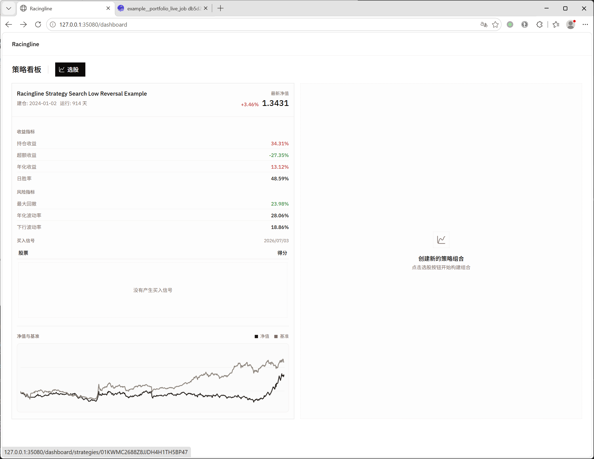
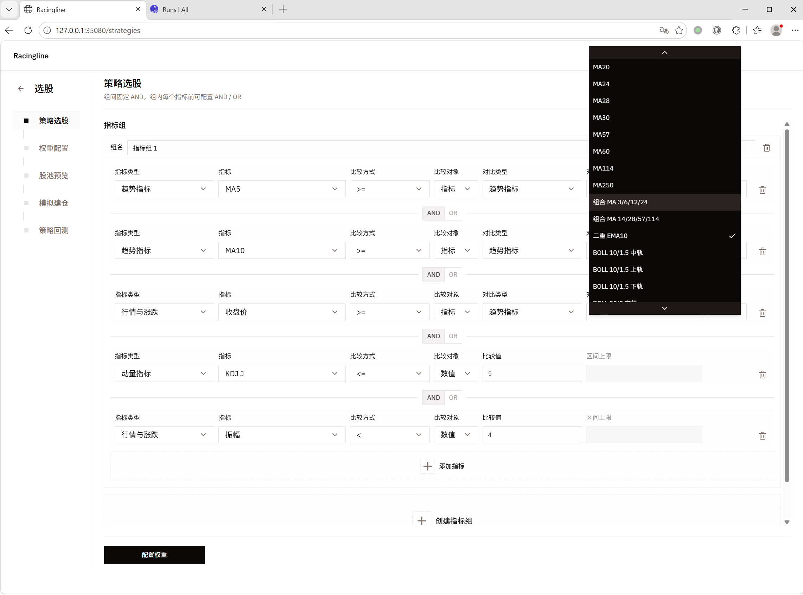
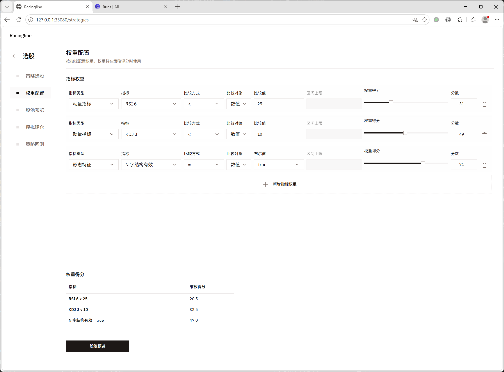
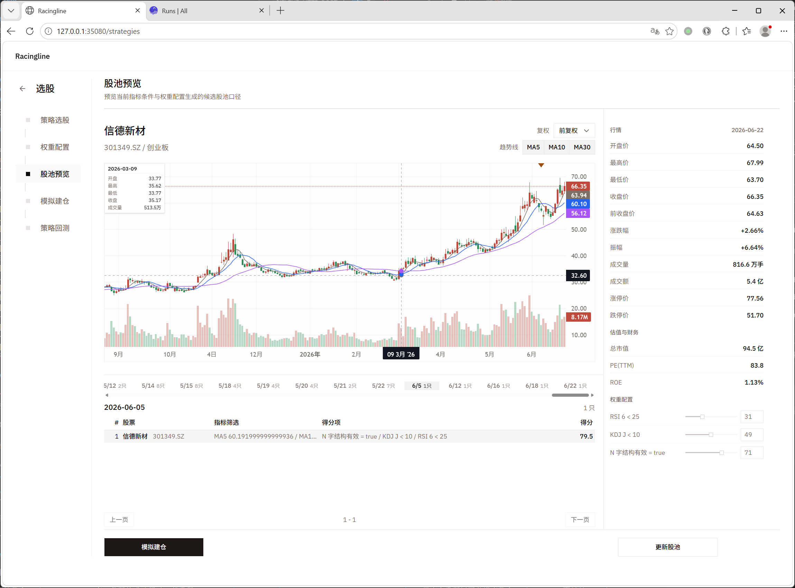
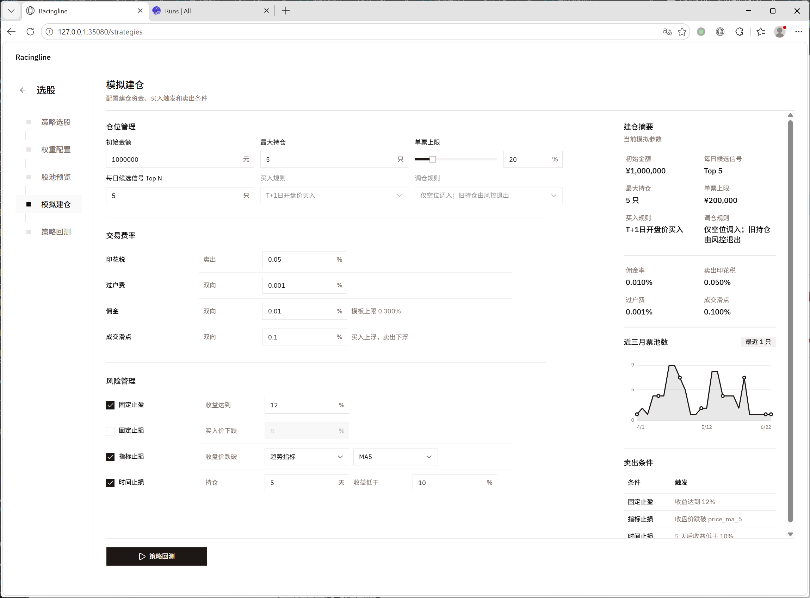
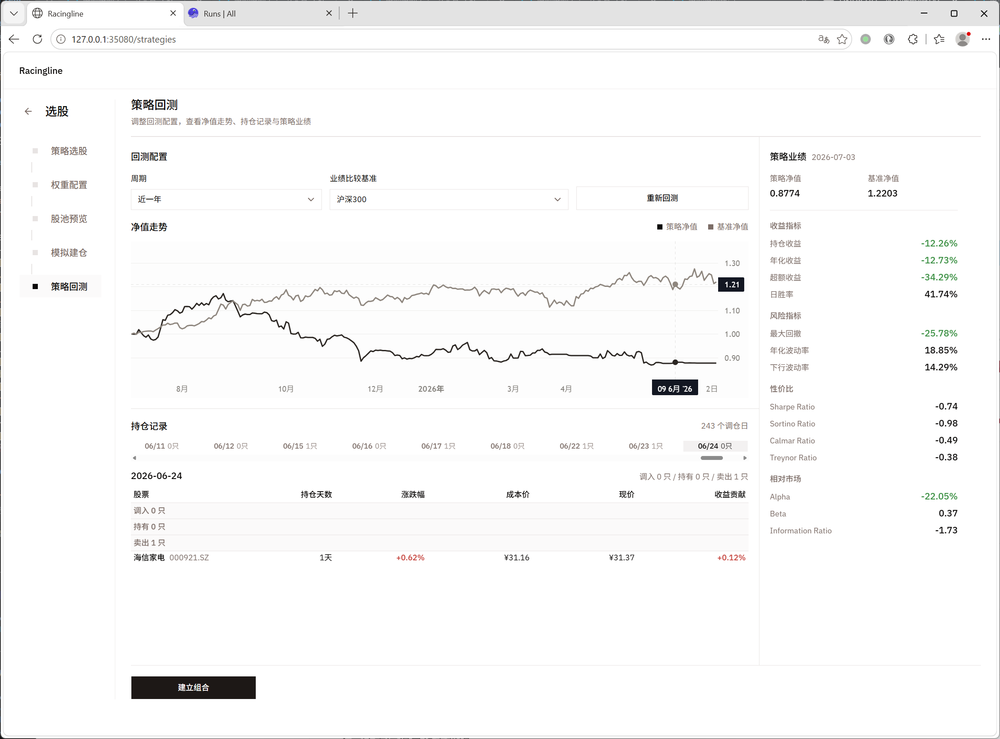
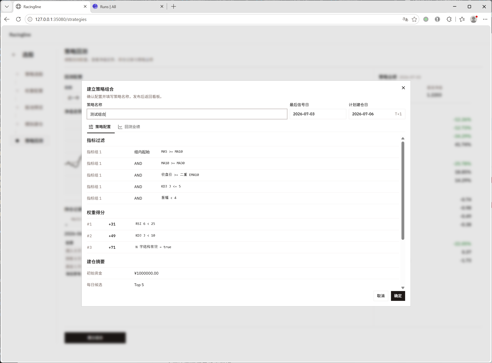
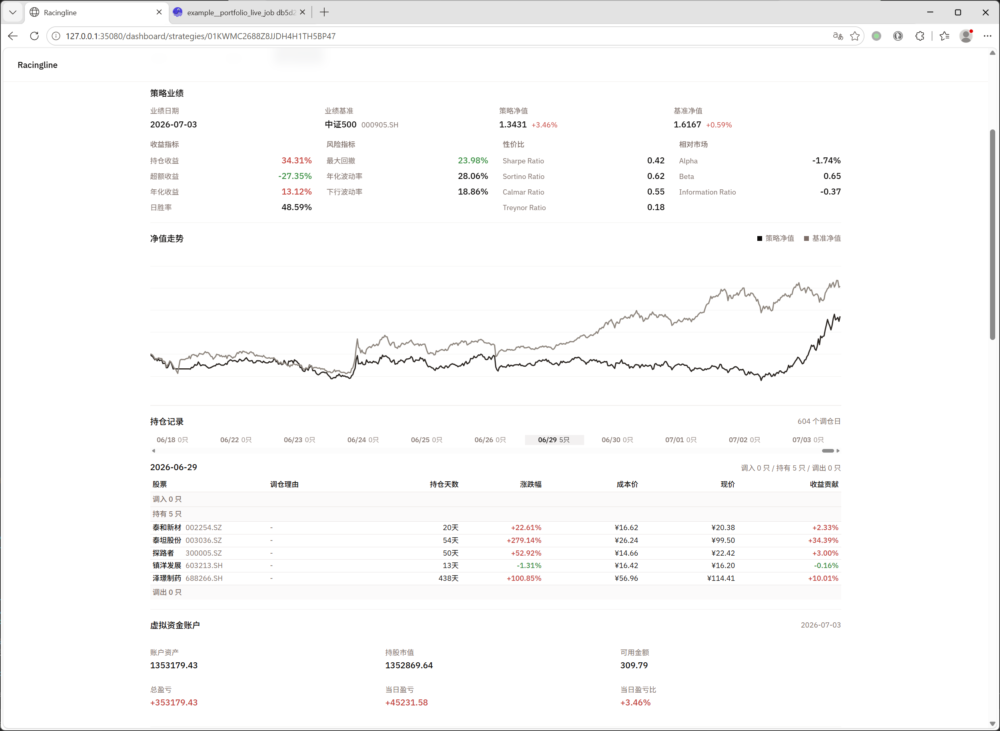

# Racingline 用户手册

## 适用范围

- Racingline 是 Rearview 策略研究、策略回测和策略组合监控前端。
- 本手册覆盖策略看板、选股建模、权重配置、股池预览、模拟建仓、策略回测、建立组合和组合详情查看。
- production-like 统一入口：`http://127.0.0.1:35080/`
- 本地开发入口：`http://127.0.0.1:5173/`

## 启动与访问

```bash
make prod-up
```

打开：

```text
http://127.0.0.1:35080/dashboard
```

## 基本流程

| 步骤 | 页面 | 目的 | 下一步 |
| --- | --- | --- | --- |
| 1 | 策略看板 | 查看已有策略组合，或进入选股流程 | 点击“选股” |
| 2 | 策略选股 | 配置候选股票过滤条件 | 点击“配置权重” |
| 3 | 权重配置 | 配置评分规则和权重得分 | 点击“股池预览” |
| 4 | 股池预览 | 查看候选股、行情 K 线和得分结果 | 点击“模拟建仓” |
| 5 | 模拟建仓 | 配置资金、仓位、费用和卖出条件 | 点击“策略回测” |
| 6 | 策略回测 | 查看净值、持仓和业绩指标 | 点击“建立组合” |
| 7 | 建立组合 | 命名并发布策略组合 | 返回策略看板 |
| 8 | 组合详情 | 查看 live 组合业绩、持仓和账户状态 | 持续监控 |

## 策略看板

进入 `/dashboard` 后，页面标题为“策略看板”。左侧展示已有策略组合卡片，卡片中包含建仓日期、运行天数、最新净值、收益指标、风险指标、买入信号和净值曲线。点击组合卡片可以进入该组合详情页。

右侧空态提示“创建新的策略组合”，点击顶部“选股”按钮进入 `/strategies` 策略创建流程。

<div align="center">
    <a href="../assets/racingline_dashboard.png">
        
    </a>
</div>
</br>

## Step 1：策略选股

“策略选股”用于配置候选股票过滤条件。页面左侧是流程导航：策略选股、权重配置、股池预览、模拟建仓、策略回测。

在指标组内，每条指标条件都需要配置：

- 指标类型
- 指标
- 比较方式
- 比较对象
- 对比类型或比较值

组间固定为 AND；组内每个指标前可以配置 AND 或 OR。可以点击“添加指标”增加条件，点击“创建指标组”增加新的指标组。配置完成后，点击底部“配置权重”进入下一步。

<div align="center">
    <a href="../assets/racingline_stragegies_step_1.png">
        
    </a>
</div>
</br>

## Step 2：权重配置

“权重配置”用于给候选股票设置评分规则。每条权重条件包含指标类型、指标、比较方式、比较对象、比较值和权重得分。

右侧的滑条和分数字段控制该条件命中后的得分。底部“权重得分”表会展示缩放后的得分结果，方便确认各评分项的相对权重。需要增加评分项时，点击“新增指标权重”。配置完成后，点击“股池预览”。

<div align="center">
    <a href="../assets/racingline_stragegies_step_2.png">
        
    </a>
</div>
</br>

## Step 3：股池预览

“股池预览”用于检查当前过滤条件和权重配置生成的候选股池。

页面中部展示选中股票的 K 线图，可以切换复权方式，并查看 MA5、MA10、MA30 等趋势线。右侧展示行情、估值与财务数据，以及当前权重配置。下方日期轴展示不同交易日的候选股数量；候选股表展示股票、指标筛选结果、得分项和总得分。

修改前面步骤的参数后，可以点击“更新股池”刷新候选结果。确认股池表现后，点击“模拟建仓”。

<div align="center">
    <a href="../assets/racingline_stragegies_step_3.png">
        
    </a>
</div>
</br>

## Step 4：模拟建仓

“模拟建仓”用于配置回测使用的资金、仓位、费用和卖出条件。

仓位管理区域包含初始金额、最大持仓、每日候选信号 Top N、单票上限、买入规则和调仓规则。交易费率区域包含印花税、过户费、佣金和成交滑点。风险管理区域可以启用固定止盈、固定止损、指标止损和时间止损。

右侧“建仓摘要”会实时汇总当前模拟参数，并展示近三月票池数和卖出条件。确认配置后，点击“策略回测”发起回测。

<div align="center">
    <a href="../assets/racingline_stragegies_step_4.png">
        
    </a>
</div>
</br>

## Step 5：策略回测

“策略回测”展示当前策略的回测结果。可以调整周期和业绩比较基准，也可以点击“重新回测”按当前配置重新生成结果。

页面主要区域展示净值走势和持仓记录。右侧“策略业绩”展示策略净值、基准净值、收益指标、风险指标、性价比和相对市场指标。确认结果可接受后，点击“建立组合”。

<div align="center">
    <a href="../assets/racingline_stragegies_step_5.png">
        
    </a>
</div>
</br>

## 建立策略组合

点击“建立组合”后，系统会打开确认弹窗。先填写“策略名称”，再核对最后信号日、计划建仓日、策略配置和回测业绩。

弹窗中“策略配置”页签展示指标过滤、权重得分和建仓摘要；“回测业绩”页签用于核对发布前的回测表现。系统会按交易阶段校验最后信号日和计划建仓日；如果校验不通过，确认按钮不会允许发布。确认无误后点击“确定”，发布成功后返回策略看板。

<div align="center">
    <a href="../assets/racingline_stragegies_step_5_renamed.png">
        
    </a>
</div>
</br>

## 组合详情

发布后的策略组合会出现在策略看板中。点击组合卡片进入详情页。

详情页展示 live 组合的策略业绩、净值走势、持仓记录和虚拟资金账户。策略业绩区包含收益指标、风险指标、性价比和相对市场指标；持仓记录按日期展示调入、持有和调出股票；虚拟资金账户展示账户资产、持股市值、可用金额、总盈亏、当日盈亏和当日盈亏比。

<div align="center">
    <a href="../assets/racingline_stragegies_strategies_info_1.png">
        
    </a>
</div>
</br>

## 常见处理

如果策略看板没有数据，先确认 Rearview 服务和数据更新链路已经运行。

首次空库初始化参考 [数据回填用户手册](数据回填用户手册.md)

日常增量调度参考 [增量作业调度用户手册](增量作业调度用户手册.md)。

如果股池为空，优先回到“策略选股”和“权重配置”检查过滤条件是否过窄，再点击“更新股池”重新预览。
