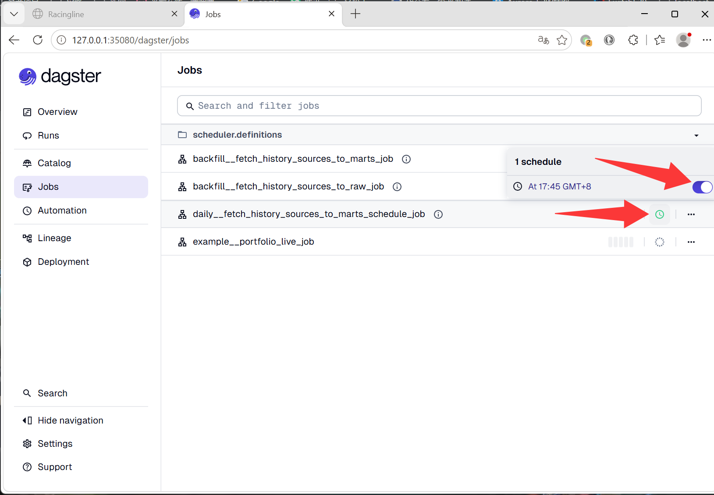

# 增量作业调度用户手册

## 适用版本

- scheduler: `0.1.0`
- Dagster Web UI job: `daily__fetch_history_sources_to_marts_schedule_job`
- Web UI: http://127.0.0.1:35080/dagster/jobs


## Web UI 入口

在 Dagster Web UI 中进入： http://127.0.0.1:35080/dagster/jobs

<div align="center">
    <a href="../assets/fetch_daily_data_1.png">
        
    </a>
</div>
</br>

``` text
daily__fetch_history_sources_to_marts_schedule_job
```

把定时任务开关打开即可，设定是每天盘后 17:45 分更新数据， baostock 数据源一般 17:30 分停机维护结束提供最新交易日数据。最好自己改改错峰下载，否则服务器拥堵会很慢， 公开的免费数据源尽量凌晨的时候用的人少会快一点。

调度时间改 [`definitions.py`](../pipeline/scheduler/src/scheduler/defs/daily/definitions.py) 后重新部署就会生效


```python
DAILY_SCHEDULE_CRON = "45 17 * * *"
```

---

daily__fetch_history_sources_to_marts_schedule_job

包含了策略组合净值清算的部分。数据最后跑完了会对策略面板内的组合执行清算。
