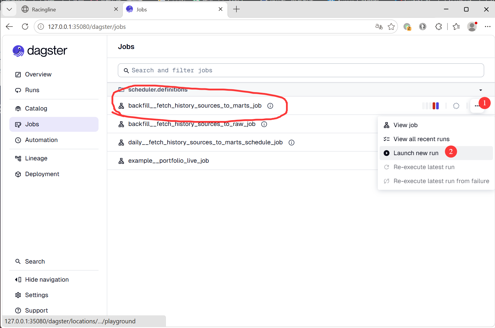
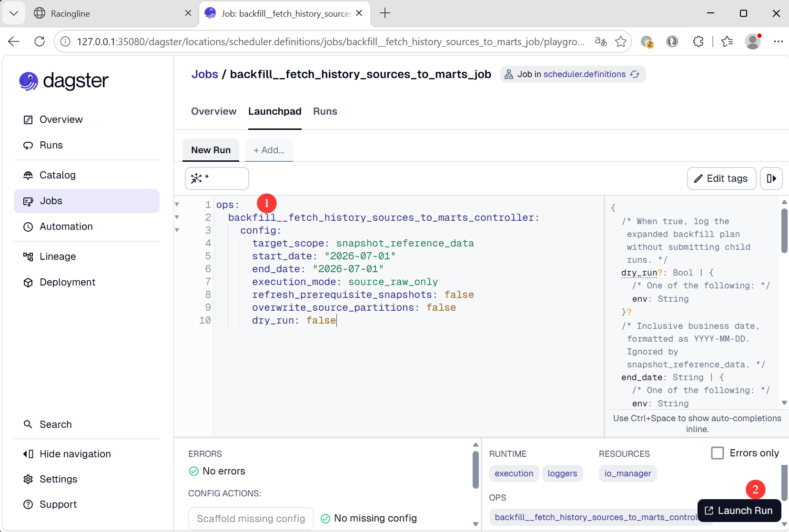

# 数据回填用户手册

## 适用版本

- scheduler: `0.1.0`
- Dagster Web UI job: `backfill__fetch_history_sources_to_marts_job`
- 适用场景：S3 source 数据和 ClickHouse raw 数据都为空，需要初始化 source -> raw -> stg -> int -> calculation -> mart。
- Web UI: http://127.0.0.1:35080/dagster/jobs

## 数据回填执行策略

本次改为两阶段执行：

| 阶段 | execution_mode | 目的 |
| --- | --- | --- |
| 阶段一 | `source_raw_only` | 先把 S3 source 和 ClickHouse raw 全部回填完成 |
| 阶段二 | `downstream_only` | 一次性从 raw 推进到 stg、int、calculation 和 mart |

## 本次回填范围

| 顺序 | target_scope | 日期范围 | 说明 |
| --- | --- | --- | --- |
| 1 | `snapshot_reference_data` | 日期必填但会被忽略 | 交易日历、股票基础信息及其 stg/int/mart |
| 2 | `baostock_daily_kline` | `2021-01-01` 到 2026 年当前可回填截止日 | BaoStock 日 K、股票行情 int、6 个 Furnace calculation、技术指标 marts |
| 3 | `market_events` | `2025-01-01` 到 2026 年当前可回填截止日 | 当前 source-to-marts 中只包含 THS limit up pool；Jiuyan 异动排除 |
| 4 | `eastmoney_f10` | `1990-01-01` 到 2026 年当前可回填截止日 | EastMoney F10、股本/除权/估值/行情相关 int 和 mart |
| 5 | `chinabond` | `2006-01-01` 到 2026 年当前可回填截止日 | ChinaBond 国债收益率、risk free rate int 和 mart |


## Web UI 入口

在 Dagster Web UI 中进入： http://127.0.0.1:35080/dagster/jobs

<div align="center">
    <a href="../assets/fetch_history_data_1.png">
        
    </a>
</div>
</br>


```text
Jobs -> backfill__fetch_history_sources_to_marts_job -> Launch new run
```
每个配置都按同样流程执行：

<div align="center">
    <a href="../assets/fetch_history_data_2.png">
        
    </a>
</div>
</br>

## 阶段一：S3 Source -> ClickHouse Raw

### 1.  依赖数据快照（证券基本信息+交易日历）

```yaml
ops:
  backfill__fetch_history_sources_to_marts_controller:
    config:
      target_scope: snapshot_reference_data
      start_date: "2026-07-01"
      end_date: "2026-07-01"
      execution_mode: source_raw_only
      refresh_prerequisite_snapshots: false
      overwrite_source_partitions: false
      dry_run: false
```

### 2. BaoStock 日 K

**start_date**: "2021-01-01" 改成你需要真实回填的日期范围 </br>
**end_date**: "2026-07-01"  改成你需要真实回填的日期范围

```yaml
ops:
  backfill__fetch_history_sources_to_marts_controller:
    config:
      target_scope: baostock_daily_kline
      start_date: "2021-01-01"
      end_date: "2026-07-01"
      execution_mode: source_raw_only
      refresh_prerequisite_snapshots: false
      overwrite_source_partitions: false
      dry_run: false
```

> baostock 提供 1990 - 至今的日K ，限流每日50000次调用 ， 限制并发登录 （记录自2026-06-22）</br>
> 这个 job 配置会**自动拆分区间逐年下载**， 每年大约5000个个股+指数调用， **最多不要单日回填超过9年**， 否则超过限流次数会被数据源拉黑名单 </br>
> 每年数据的下载时间视网络情况而定， 最快3分钟，慢得超过20分钟 ，回填五年基本要一个小时以上， 只要不报错就不用管</br>
> 回填三年就够回测用了，数据有其他用途也可以自行选择回填范围


### 3. 涨停板数据（源端只提供近380自然日数据，超出范围无效）

**start_date**: "2021-01-01" 改成你需要真实回填的日期范围 </br>
**end_date**: "2026-07-01"  改成你需要真实回填的日期范围

```yaml
ops:
  backfill__fetch_history_sources_to_marts_controller:
    config:
      target_scope: market_events
      start_date: "2025-01-01"
      end_date: "2026-07-01"
      execution_mode: source_raw_only
      refresh_prerequisite_snapshots: false
      overwrite_source_partitions: false
      dry_run: false
```
### 4. 东方财富F10

**start_date**: "1990-01-01" 改成你需要真实回填的日期范围 </br>
**end_date**: "2026-07-01"  改成你需要真实回填的日期范围

```yaml
ops:
  backfill__fetch_history_sources_to_marts_controller:
    config:
      target_scope: eastmoney_f10
      start_date: "1990-01-01"
      end_date: "2026-07-01"
      execution_mode: source_raw_only
      refresh_prerequisite_snapshots: false
      overwrite_source_partitions: false
      dry_run: false
```

> 37年跑完也要一个多小时 ， 前面几秒钟一年 后面十几分钟一年。

### 5. 中债收益率 （2006-01-01开始）

**start_date**: "2006-01-01" 改成你需要真实回填的日期范围 </br>
**end_date**: "2026-07-01"  改成你需要真实回填的日期范围

```yaml
ops:
  backfill__fetch_history_sources_to_marts_controller:
    config:
      target_scope: chinabond
      start_date: "2006-01-01"
      end_date: "2026-07-01"
      execution_mode: source_raw_only
      refresh_prerequisite_snapshots: false
      overwrite_source_partitions: false
      dry_run: false
```

## 阶段二：一次性 Stg -> Int -> Calculation -> Mart

```yaml
ops:
  backfill__fetch_history_sources_to_marts_controller:
    config:
      target_scope: all_source_to_marts
      start_date: "2021-01-01"
      end_date: "2026-07-01"
      execution_mode: downstream_only
      refresh_prerequisite_snapshots: false
      overwrite_source_partitions: false
      dry_run: false
```

覆盖范围包括：

- Snapshot reference data downstream：交易日历、股票基础信息、基础 snapshot int/mart。
- BaoStock downstream：股票行情核心 int、Furnace calculation、calculation wrappers、股票行情和技术指标 marts。
- Market events downstream：`stg_ths__limit_up_pool_compacted`。
- EastMoney F10 downstream：9 个 `stg_eastmoney__*`、股本/除权/估值/行情相关 int、`mart_stock_quotes_daily`。
- ChinaBond downstream：`stg_chinabond__government_bond`、`int_government_bond_yields_daily`、`int_risk_free_rate_daily`、`mart_risk_free_rate_daily`。

`furnace_calculation` 应包含 6 个股票技术指标：

- `fleur_calculation/calc_stock_kdj_daily`
- `fleur_calculation/calc_stock_ma_daily`
- `fleur_calculation/calc_stock_rsi_daily`
- `fleur_calculation/calc_stock_boll_daily`
- `fleur_calculation/calc_stock_macd_daily`
- `fleur_calculation/calc_stock_price_pattern_daily`

dry-run 时 Furnace child config 使用 `mode: dry-run`；真实执行时使用历史修复语义 `mode: replace-cascade`。

## 失败恢复

### 阶段一失败

优先修复失败原因后，重新执行同一个 target_scope 的阶段一配置。已经成功的其他 scope 不需要重跑。

如果 BaoStock source 分区已经写出但需要重新抓取，才把：

```yaml
overwrite_source_partitions: true
```

空库首次回填保持 `false`。

### 阶段二失败

修复失败原因后，重新执行阶段二配置，也就是继续使用：

```yaml
target_scope: all_source_to_marts
execution_mode: downstream_only
```

阶段二不会重新提交 source/raw。

### 日期写到未来导致失败

如果日志出现类似：

```text
end_date cannot be later than today's Asia/Shanghai date
```

把 `end_date` 改成运行更早的有效日期后重试。
